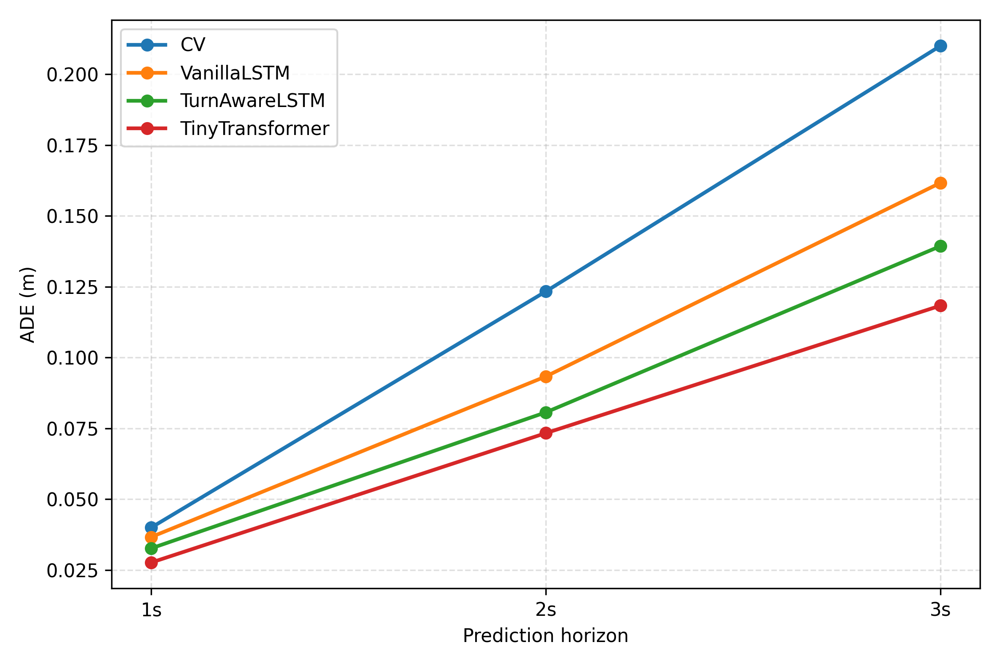
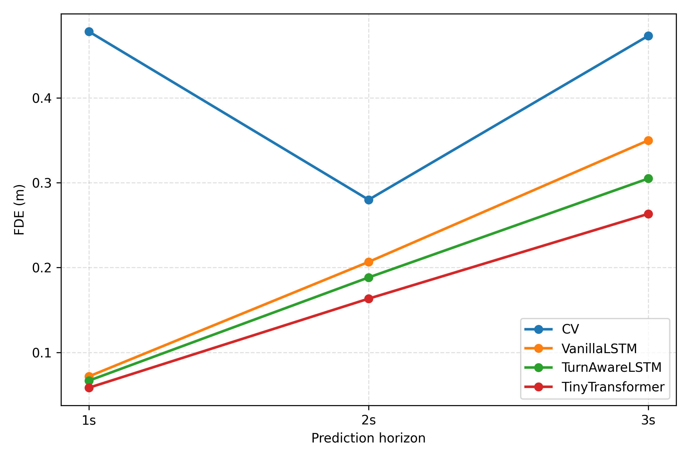

# Turn-Aware LSTM Model for Vehicle Trajectory Forecasting

**Xingnan Zhou**, Ciprian Alecsandru, Saman Bashbaghi, Yunseo Jeong, Ye Chen
*Advances in Transportation Studies (ATS), Vol. LXVIII, pp. 381&ndash;396, April 2026*

Published in a subscription journal &mdash; full text available via ATS. [[Project Page]](https://obsicat.com/turn-aware-lstm.html)

---

## Overview

This repository contains the code and supplementary materials for our paper on vehicle trajectory forecasting at intersections. We propose a **Turn-Aware LSTM** encoder-decoder architecture that incorporates one-hot turn-maneuver labels (straight, left turn, right turn) as auxiliary input features to improve prediction accuracy during turning maneuvers.

Standard trajectory prediction models struggle at intersections where vehicles deviate from straight-line paths. By conditioning on turn-intent labels, our model significantly reduces prediction error for turning vehicles while maintaining competitive performance on straight trajectories.

### Key Contributions
- An LSTM encoder-decoder that fuses positional features with one-hot turn labels
- Systematic evaluation across straight, left-turn, and right-turn maneuvers at 1s, 2s, and 3s prediction horizons
- Sensitivity analysis on turn-label feature importance

## Architecture

The model uses a two-stage encoder-decoder design:

1. **Encoder LSTM** — Processes the observed trajectory augmented with one-hot turn labels `[center_x, center_y, is_straight, is_left, is_right]`. The encoder compresses the input sequence into a hidden state representation.
2. **Decoder LSTM** — Autoregressively generates future positions `(x, y)` for the prediction horizon, initialized with the encoder's final hidden/cell states.

```
Input: [x, y, turn_label_onehot] × T_obs
        ↓
  LSTM Encoder (2 layers, 128 hidden)
        ↓
  Hidden State (h, c)
        ↓
  LSTM Decoder (2 layers, 128 hidden) × T_pred
        ↓
Output: [x, y] × T_pred
```

## Results

### Overall Performance (ADE / FDE in meters)

| Model | 1s | 2s | 3s |
|-------|------|------|------|
| Constant Velocity | 0.040 / 0.478 | 0.123 / 0.280 | 0.210 / 0.473 |
| Vanilla LSTM | 0.037 / 0.072 | 0.093 / 0.207 | 0.162 / 0.350 |
| **Turn-Aware LSTM** | **0.033 / 0.067** | **0.081 / 0.188** | **0.139 / 0.305** |
| TinyTransformer | 0.028 / 0.058 | 0.073 / 0.163 | 0.118 / 0.263 |

### Turning Maneuver Performance (ADE / FDE at 3s horizon)

| Model | Straight | Left Turn | Right Turn |
|-------|----------|-----------|------------|
| Constant Velocity | 0.110 / 0.220 | 0.200 / 0.480 | 0.320 / 0.720 |
| Vanilla LSTM | 0.095 / 0.190 | 0.160 / 0.340 | 0.230 / 0.520 |
| **Turn-Aware LSTM** | 0.098 / 0.195 | **0.130 / 0.280** | **0.190 / 0.440** |

The Turn-Aware LSTM shows the largest improvements on turning maneuvers, reducing left-turn FDE by 17.6% and right-turn FDE by 15.4% compared to the Vanilla LSTM.

<p align="center">
  
  
</p>

## Repository Structure

```
.
├── lstmmodel_architecture.py       # Model definition and training pipeline
├── lstm_experiments_turn_split.py   # Experiments with turn-based data splitting
├── left_label_creation.py           # Turn label extraction from trajectories
├── analysing_turning.py             # Turn behavior analysis
├── sensitivity_analysis_turning.py  # Feature sensitivity experiments
├── error_eval_05_10_15sec.py        # Error evaluation at multiple horizons
├── cal_overall_results.py           # Aggregate results computation
├── plot_avg.py                      # Average performance plots
├── plot_maneuver.py                 # Per-maneuver comparison plots
├── results/
│   ├── results_overall.csv          # Overall ADE/FDE metrics
│   ├── results_by_maneuver.csv      # Per-maneuver ADE/FDE metrics
│   └── figs/                        # Generated figures
└── *.ipynb                          # Jupyter notebooks (exploratory analysis)
```

## Requirements

- Python 3.8+
- PyTorch >= 1.12
- NumPy, Pandas, Matplotlib
- scikit-learn
- OpenCV (for video-based evaluation)

```bash
pip install torch numpy pandas matplotlib scikit-learn opencv-python
```

## Usage

### Training

```python
python lstmmodel_architecture.py
```

The script loads trajectory data from `csv_out/`, creates turn-aware input sequences, trains the encoder-decoder model, and evaluates on held-out data.

### Evaluation

```python
python error_eval_05_10_15sec.py      # Evaluate at 0.5s, 1.0s, 1.5s
python cal_overall_results.py          # Compute overall metrics
python plot_maneuver.py                # Generate per-maneuver comparison plots
```

## Citation

```bibtex
@article{zhou2026turnaware,
  title={Turn-Aware LSTM Model for Vehicle Trajectory Forecasting},
  author={Zhou, Xingnan and Alecsandru, Ciprian and Bashbaghi, Saman and Jeong, Yunseo and Chen, Ye},
  journal={Advances in Transportation Studies},
  volume={LXVIII},
  pages={381--396},
  year={2026}
}
```

## License

This code is released under the [MIT License](LICENSE). Please cite our paper if you use this code in your work.
